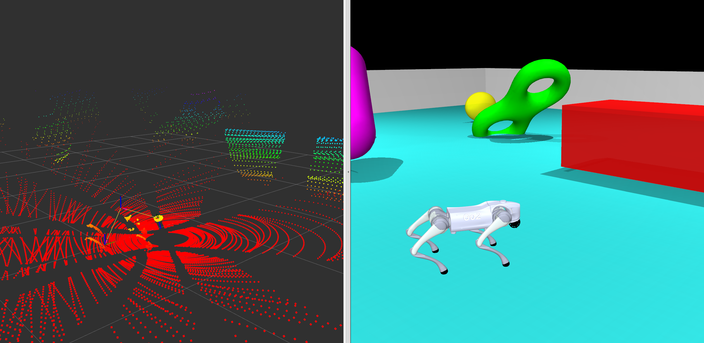
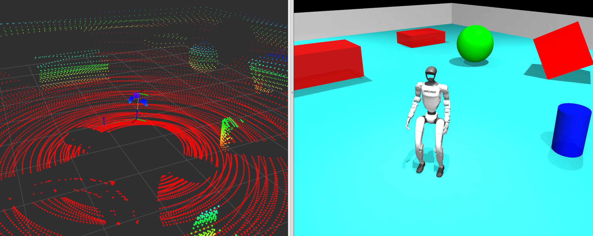

# MuJoCo-LiDAR: 基于MuJoCo的高性能激光雷达仿真

基于MuJoCo的高性能激光雷达仿真工具，支持CPU、Taichi和JAX后端，提供强大的GPU并行计算支持。

<p align="center">
  
  
</p>
<p align="center">
  
  
  
</p>


[English Document](README.md)

## 🌟 特点

- **多后端支持**：
  - **CPU后端**：基于MuJoCo原生的`mj_multiRay`函数，无需GPU，简单易用
  - **Taichi后端**：利用Taichi实现GPU高效并行计算，性能更强，支持百万面片的mesh场景
  - **JAX后端**：利用JAX实现GPU并行计算，支持MJX集成
- **高性能**：GPU加速后端能在毫秒级生成100万+射线
- **动态场景**：支持动态场景实时bvh构建，实现快速LiDAR扫描
- **多种激光雷达模型**：支持多种扫描模式：
  - Livox非重复扫描模式: mid360 mid70 mid40 tele avia
  - Velodyne HDL-64E、VLP-32C
  - Ouster OS-128
  - 可自定义网格扫描模式
- **精确的物理模拟**：对所有MuJoCo几何体类型进行射线追踪：盒体、球体、椭球体、圆柱体、胶囊体、平面和mesh网格
- **灵活的API**：提供统一的Wrapper接口和底层Core接口两种使用方式
- **ROS集成**：提供即用型ROS1和ROS2示例

## 🔧 安装

### 系统要求

**基础依赖（所有后端都需要）：**
- Python >= 3.8
- MuJoCo >= 3.2.0
- NumPy >= 1.20.0

**可选后端依赖：**
- **Taichi**: `taichi >= 1.6.0`, `tibvh`
- **JAX**: `jax`, `jaxlib`

### 快速安装

```bash
# 克隆仓库
git clone https://github.com/TATP-233/MuJoCo-LiDAR.git
cd MuJoCo-LiDAR

# 1. 安装基础依赖（CPU后端）
pip install -e .

# 2. 安装Taichi后端依赖
pip install -e ".[taichi]"

# 3. 安装JAX后端依赖
pip install -e ".[jax]"
```

**注意**：
- CPU后端不需要安装Taichi和TIBVH，开箱即用
- Taichi后端需要配置好cuda的nvidia显卡或其他Taichi支持的GPU

## 📚 使用示例

[ros集成](#-ros集成)提供了快速上手的ros1/2的示例，[宇树Go2/G1](#-更多示例)。

MuJoCo-LiDAR 提供两种使用方式和两种后端选择：

### 使用方式对比

1. **Wrapper方式（推荐）**：使用 `MjLidarWrapper` 类，提供统一的高层接口，自动处理后端差异
2. **Core方式（高级）**：直接使用底层的 `MjLidarCPU` 或 `MjLidarTi` 类，提供更细粒度的控制

### 后端选择

1. **CPU后端**：
   - 优点：无需GPU，依赖少，易于部署
   - 适用场景：简单场景、射线数量较少（<10000）、无GPU环境、场景只包含简单几何原语、无复杂mesh
   - 性能：使用MuJoCo原生 `mj_multiRay` 函数

2. **Taichi后端**：
   - 优点：高性能，适合大规模射线追踪，支持复杂Mesh场景
   - 适用场景：复杂场景、大量射线（>10000）、需要实时性能、复杂mesh文件
   - 性能：GPU并行计算，毫秒级处理100万+射线

3. **JAX后端**：
   - 优点：高性能，支持**批量仿真**（多环境并行）
   - 适用场景：涉及JAX/MJX的研究，大规模并行仿真，简单几何场景（Primitives）
   - 注意：目前不支持Mesh几何体

### 方式一：使用Wrapper（推荐，简单易用）

Wrapper方式提供统一的接口，自动处理后端差异。这是**推荐的使用方式**。

#### 示例1：CPU后端 + Wrapper（通过字符串定义场景）

```python
import time
import mujoco
import mujoco.viewer

from mujoco_lidar import MjLidarWrapper
from mujoco_lidar import scan_gen

# 定义简单的MuJoCo场景
simple_demo_scene = """
<mujoco model="simple_demo">
    <worldbody>
        <!-- 地面+四面墙 -->
        <geom name="ground" type="plane" size="5 5 0.1" pos="0 0 0" rgba="0.2 0.9 0.9 1"/>
        <geom name="wall1" type="box" size="1e-3 3 1" pos=" 3 0 1" rgba="0.9 0.9 0.9 1"/>
        <geom name="wall2" type="box" size="1e-3 3 1" pos="-3 0 1" rgba="0.9 0.9 0.9 1"/>
        <geom name="wall3" type="box" size="3 1e-3 1" pos="0  3 1" rgba="0.9 0.9 0.9 1"/>
        <geom name="wall4" type="box" size="3 1e-3 1" pos="0 -3 1" rgba="0.9 0.9 0.9 1"/>

        <!-- 不同几何体 -->
        <geom name="box1" type="box" size="0.5 0.5 0.5" pos="2 0 0.5" euler="45 -45 0" rgba="1 0 0 1"/>
        <geom name="sphere1" type="sphere" size="0.5" pos="0 2 0.5" rgba="0 1 0 1"/>
        <geom name="cylinder1" type="cylinder" size="0.4 0.6" pos="0 -2 0.4" euler="0 90 0" rgba="0 0 1 1"/>
        
        <!-- 激光雷达站点 -->
        <body name="lidar_base" pos="0 0 1" quat="1 0 0 0" mocap="true">
            <inertial pos="0 0 0" mass="1e-4" diaginertia="1e-9 1e-9 1e-9"/>
            <site name="lidar_site" size="0.001" type='sphere'/>
            <geom type="box" size="0.1 0.1 0.1" density="0" contype="0" conaffinity="0" rgba="0.3 0.6 0.3 0.2"/>
        </body>
    </worldbody>
</mujoco>
"""

# 创建MuJoCo模型和数据
mj_model = mujoco.MjModel.from_xml_string(simple_demo_scene)
mj_data = mujoco.MjData(mj_model)

# 生成扫描模式
rays_theta, rays_phi = scan_gen.generate_grid_scan_pattern(num_ray_cols=64, num_ray_rows=16)

# 获取需要排除的body ID（避免激光雷达检测到自身）
exclude_body_id = mj_model.body("lidar_base").id

# 创建CPU后端的激光雷达传感器
lidar = MjLidarWrapper(
    mj_model, 
    site_name="lidar_site",
    backend="cpu",  # 使用CPU后端
    cutoff_dist=50.0,  # 最大检测距离50米
    args={'bodyexclude': exclude_body_id}  # CPU后端特定参数：排除body
)

# 在模拟循环中使用
with mujoco.viewer.launch_passive(mj_model, mj_data) as viewer:
    while viewer.is_running():
        mujoco.mj_step(mj_model, mj_data)
        viewer.sync()
        
        # 执行射线追踪（Wrapper自动处理位姿更新）
        lidar.trace_rays(mj_data, rays_theta, rays_phi)
        
        # 获取点云数据（本地坐标系）
        points = lidar.get_hit_points()  # shape: (N, 3)
        distances = lidar.get_distances()  # shape: (N,)
        
        time.sleep(1./60.)
```

#### 示例2：Taichi后端 + Wrapper（从MJCF文件加载）

```python
import mujoco
from mujoco_lidar import MjLidarWrapper, scan_gen

# 从文件加载MuJoCo模型
mj_model = mujoco.MjModel.from_xml_path("path/to/your/model.xml")
mj_data = mujoco.MjData(mj_model)

# 生成扫描模式（使用Velodyne HDL-64）
rays_theta, rays_phi = scan_gen.generate_HDL64()

# 创建Taichi后端的激光雷达传感器
lidar = MjLidarWrapper(
    mj_model,
    site_name="lidar_site",
    backend="taichi",  # 使用Taichi后端
    cutoff_dist=100.0,
    args={
        'max_candidates': 64,  # Taichi后端特定参数：BVH候选节点数
        'ti_init_args': {'device_memory_GB': 4.0}  # Taichi初始化参数
    }
)

# 模拟循环
with mujoco.viewer.launch_passive(mj_model, mj_data) as viewer:
    while viewer.is_running():
        mujoco.mj_step(mj_model, mj_data)
        
        # Taichi后端的使用方式与CPU相同
        lidar.trace_rays(mj_data, rays_theta, rays_phi)
        points = lidar.get_hit_points()
```

#### Wrapper方式的参数说明

```python
MjLidarWrapper(
    mj_model,           # MuJoCo模型
    site_name,          # 激光雷达site名称
    backend="cpu",      # "cpu" 或 "taichi"
    cutoff_dist=100.0,  # 最大检测距离（米）
    args={}             # 后端特定参数
)

# CPU后端参数 (args)
{
    'geomgroup': None,      # 几何体组过滤 (0-5, None表示所有)
    'bodyexclude': -1       # 排除的body ID（-1表示不排除）
}

# Taichi后端参数 (args)
{
    'max_candidates': 32,   # BVH最大候选节点数（16-128）
    'ti_init_args': {}      # Taichi初始化参数
}
```

### 方式二：直接使用Core（高级用户）

Core方式提供对底层API的直接访问，适合需要精细控制的高级用户。

#### 示例3：CPU Core方式

```python
import numpy as np
import mujoco
from mujoco_lidar.core_cpu.mjlidar_cpu import MjLidarCPU
from mujoco_lidar import scan_gen

# 创建模型
mj_model = mujoco.MjModel.from_xml_string(xml_string)
mj_data = mujoco.MjData(mj_model)

# 生成扫描模式
rays_theta, rays_phi = scan_gen.generate_grid_scan_pattern(64, 16)

# 创建CPU核心实例
lidar_cpu = MjLidarCPU(
    mj_model,
    cutoff_dist=50.0,
    geomgroup=None,      # 检测所有几何体组
    bodyexclude=-1       # 不排除任何body
)

# 模拟循环
with mujoco.viewer.launch_passive(mj_model, mj_data) as viewer:
    while viewer.is_running():
        mujoco.mj_step(mj_model, mj_data)
        
        # 手动构建4x4位姿矩阵
        pose_4x4 = np.eye(4, dtype=np.float32)
        pose_4x4[:3, 3] = mj_data.site("lidar_site").xpos
        pose_4x4[:3, :3] = mj_data.site("lidar_site").xmat.reshape(3, 3)
        
        # 更新数据并执行射线追踪
        lidar_cpu.update(mj_data)
        lidar_cpu.trace_rays(pose_4x4, rays_theta, rays_phi)
        
        # 获取结果
        points = lidar_cpu.get_hit_points()
        distances = lidar_cpu.get_distances()
```

#### 示例4：Taichi Core方式

```python
import numpy as np
import mujoco
import taichi as ti
from mujoco_lidar.core_ti.mjlidar_ti import MjLidarTi
from mujoco_lidar import scan_gen_livox_ti

# 初始化Taichi（必须在创建MjLidarTi之前）
ti.init(arch=ti.gpu, device_memory_GB=4.0)

# 创建模型
mj_model = mujoco.MjModel.from_xml_string(xml_string)
mj_data = mujoco.MjData(mj_model)

# 使用Livox扫描模式（Taichi优化版本）
livox_gen = scan_gen_livox_ti.LivoxGeneratorTi("mid360")

# 创建Taichi核心实例
lidar_ti = MjLidarTi(
    mj_model,
    cutoff_dist=100.0,
    max_candidates=64  # BVH候选节点数
)

# 获取Taichi格式的射线角度
rays_theta_ti, rays_phi_ti = livox_gen.sample_ray_angles_ti()

# 模拟循环
with mujoco.viewer.launch_passive(mj_model, mj_data) as viewer:
    while viewer.is_running():
        mujoco.mj_step(mj_model, mj_data)
        
        # 手动构建位姿矩阵
        pose_4x4 = np.eye(4, dtype=np.float32)
        pose_4x4[:3, 3] = mj_data.site("lidar_site").xpos
        pose_4x4[:3, :3] = mj_data.site("lidar_site").xmat.reshape(3, 3)
        
        # 更新BVH并执行射线追踪
        lidar_ti.update(mj_data)
        lidar_ti.trace_rays(pose_4x4, rays_theta_ti, rays_phi_ti)
        
        # 对于Livox，每次都需要重新采样角度
        rays_theta_ti, rays_phi_ti = livox_gen.sample_ray_angles_ti()
        
        # 获取结果（从Taichi拷贝到CPU）
        points = lidar_ti.get_hit_points()  # 返回numpy数组
        distances = lidar_ti.get_distances()
```

#### 示例5：JAX后端（批量处理）

非常适合MJX或其他基于JAX的大规模并行仿真环境。

```python
import jax
import jax.numpy as jnp
from mujoco_lidar.core_jax import MjLidarJax

# 初始化JAX Lidar（使用host模型）
lidar = MjLidarJax(mj_model)

# 准备批量数据（例如来自MJX状态）
# batch_size = 4096
# geom_xpos: (B, Ngeom, 3)
# geom_xmat: (B, Ngeom, 3, 3)
# rays_origin: (B, 3)
# rays_direction: (B, Nrays, 3)

# 执行批量渲染
# 返回 distances: (B, Nrays)
batch_distances = lidar.render_batch(
    batch_geom_xpos, 
    batch_geom_xmat, 
    batch_rays_origin, 
    batch_rays_direction
)
```

## 🤖 ROS集成

MuJoCo-LiDAR提供了完整的ROS1和ROS2集成示例，支持点云发布和场景可视化。

### ROS1示例

需提前安装ros1相关依赖

```bash
# 第一个终端：启动ROS核心
roscore

# 第二个终端：运行激光雷达仿真（使用Taichi后端） 会自动开启rviz可视化
python examples/lidar_vis_ros1_wrapper.py --lidar mid360 --rate 12
```

### ROS2示例

**方式一：使用Wrapper（推荐）**

```bash
# 运行激光雷达仿真 同时会自动开启rviz可视化
python examples/lidar_vis_ros2_wrapper.py --lidar mid360 --rate 12
```

**方式二：使用Core（高级）**

```bash
# 使用底层Taichi Core API
python examples/lidar_vis_ros2.py --lidar mid360 --rate 12
```

### ROS示例命令行参数

两个ROS示例都支持以下命令行参数：

```bash
python examples/lidar_vis_ros2_wrapper.py [options]

选项:
  --lidar MODEL      指定激光雷达型号，可选值:
                     - Livox系列: avia, mid40, mid70, mid360, tele
                     - Velodyne系列: HDL64, vlp32
                     - Ouster系列: os128
                     - 自定义: custom
                     默认值: mid360
  --verbose          显示详细输出信息，包括位置、姿态和性能统计
  --rate HZ          设置点云发布频率(Hz)，默认值: 12
```

**使用示例：**

```bash
# 使用HDL64激光雷达，启用详细输出，设置发布频率为10Hz
python examples/lidar_vis_ros2_wrapper.py --lidar HDL64 --verbose --rate 10

# 使用Velodyne VLP-32，默认频率
python examples/lidar_vis_ros2_wrapper.py --lidar vlp32

# 使用自定义扫描模式
python examples/lidar_vis_ros2_wrapper.py --lidar custom
```

### 键盘交互控制

在ROS示例中，您可以使用键盘控制激光雷达的位置和姿态：

**移动控制：**
- `W`: 向前移动
- `S`: 向后移动
- `A`: 向左移动
- `D`: 向右移动
- `Q`: 向上移动
- `E`: 向下移动

**姿态控制：**
- `↑`: 俯仰向上
- `↓`: 俯仰向下
- `←`: 偏航向左
- `→`: 偏航向右

**其他：**
- `ESC`: 退出程序

### ROS话题

示例程序发布以下ROS话题：

| 话题名称 | 消息类型 | 描述 |
|---------|---------|------|
| `/lidar_points` | `sensor_msgs/PointCloud2` | 激光雷达点云数据 |
| `/mujoco_scene` | `visualization_msgs/MarkerArray` | MuJoCo场景几何体可视化 |
| `/tf` | `tf2_msgs/TFMessage` | 激光雷达坐标变换 |

### Wrapper vs Core 在ROS中的区别

**`lidar_vis_ros2_wrapper.py` (Wrapper方式)**：
- 使用 `MjLidarWrapper` 类
- 自动处理数据格式转换（numpy ↔ Taichi）
- 代码更简洁，易于维护
- 适合大多数应用场景

```python
from mujoco_lidar import MjLidarWrapper

# 创建Wrapper实例
lidar = MjLidarWrapper(mj_model, site_name="lidar_site", backend="taichi")

# 简单调用
lidar.trace_rays(mj_data, rays_theta, rays_phi)
points = lidar.get_hit_points()  # 自动返回numpy数组
```

**`lidar_vis_ros2.py` (Core方式)**：
- 直接使用 `MjLidarTi` 类
- 需要手动管理Taichi数据格式
- 需要手动构建4x4位姿矩阵
- 性能优化空间更大，适合高级用户

```python
from mujoco_lidar.core_ti.mjlidar_ti import MjLidarTi
import taichi as ti

# 必须先初始化Taichi
ti.init(arch=ti.gpu)

# 创建Core实例
lidar = MjLidarTi(mj_model)

# 需要Taichi ndarray格式
rays_theta_ti = ti.ndarray(dtype=ti.f32, shape=n_rays)
rays_phi_ti = ti.ndarray(dtype=ti.f32, shape=n_rays)
rays_theta_ti.from_numpy(rays_theta)
rays_phi_ti.from_numpy(rays_phi)

# 手动构建位姿矩阵
pose_4x4 = np.eye(4, dtype=np.float32)
pose_4x4[:3, 3] = mj_data.site("lidar_site").xpos
pose_4x4[:3, :3] = mj_data.site("lidar_site").xmat.reshape(3, 3)

# 调用
lidar.update(mj_data)
lidar.trace_rays(pose_4x4, rays_theta_ti, rays_phi_ti)
points = lidar.get_hit_points()  # 从GPU拷贝到CPU
```

## 🤝 更多示例

我们还提供了宇树机器狗go2和人形机器人g1的ros2集成。

```bash
# 安装 onnx runtime
pip install onnxruntime

# go2 example
python examples/unitree_go2_ros2.py --lidar mid360
# 选择其他lidar，例如： --lidar ariy

# go1 example
python examples/unitree_g1_ros2.py --lidar mid360
```

## ⚡ 性能优化与最佳实践

### 1. 减少射线追踪频率

激光雷达不需要和物理仿真同频运行：

```python
lidar_rate = 10  # 激光雷达10Hz
physics_rate = 60  # 物理仿真60Hz
step_cnt = 0

with mujoco.viewer.launch_passive(mj_model, mj_data) as viewer:
    while viewer.is_running():
        # 高频物理仿真
        mujoco.mj_step(mj_model, mj_data)
        step_cnt += 1
        
        # 低频激光雷达扫描
        if step_cnt % (physics_rate // lidar_rate) == 0:
            lidar.trace_rays(mj_data, rays_theta, rays_phi)
            points = lidar.get_hit_points()
```

### 2. 复用射线角度数组

对于固定扫描模式（非Livox），只生成一次角度数组：

```python
# ✅ 正确：在循环外生成一次
rays_theta, rays_phi = scan_gen.generate_HDL64()

while True:
    lidar.trace_rays(mj_data, rays_theta, rays_phi)

# ❌ 错误：每次循环都重新生成（浪费）
while True:
    rays_theta, rays_phi = scan_gen.generate_HDL64()  # 不必要！
    lidar.trace_rays(mj_data, rays_theta, rays_phi)
```

### 3. Taichi后端使用Taichi数组

使用Taichi Core方式时，避免频繁的numpy↔Taichi转换：

```python
import taichi as ti

# ✅ 正确：使用Taichi ndarray
rays_theta_ti = ti.ndarray(dtype=ti.f32, shape=n_rays)
rays_phi_ti = ti.ndarray(dtype=ti.f32, shape=n_rays)
rays_theta_ti.from_numpy(rays_theta)  # 只转换一次
rays_phi_ti.from_numpy(rays_phi)

while True:
    lidar.trace_rays(pose_4x4, rays_theta_ti, rays_phi_ti)  # 直接使用

# ❌ 错误：每次都转换（开销大）
while True:
    theta_ti = ti.ndarray(dtype=ti.f32, shape=n_rays)
    theta_ti.from_numpy(rays_theta)  # 频繁转换！
    # ...
```

### 4. Livox扫描模式优化

使用Taichi后端时，对于Livox非重复扫描，使用Taichi优化版本：

```python
from mujoco_lidar import scan_gen_livox_ti
import taichi as ti

ti.init(arch=ti.gpu)

# ✅ Taichi优化版本：直接返回Taichi数组，无需转换
livox_gen = scan_gen_livox_ti.LivoxGeneratorTi("mid360")
rays_theta_ti, rays_phi_ti = livox_gen.sample_ray_angles_ti()

# ❌ CPU版本：每次都要numpy→Taichi转换
livox_gen = scan_gen.LivoxGenerator("mid360")
rays_theta, rays_phi = livox_gen.sample_ray_angles()
# 还需要转换为Taichi格式...
```

### 5. 合理设置场景复杂度

- 移除视野外的几何体
- 使用geomgroup组织场景
- 简化不重要物体的几何形状
- 对于网格模型，考虑简化面数

## 📄 许可证

本项目采用MIT许可证 - 详见[LICENSE](LICENSE)文件

## 📜 Citation

如果发现MuJoCo-LiDAR对您的研究有用的话，请考虑引用我们的工作：

```bibtex
@article{jia2025discoverse,
    title={DISCOVERSE: Efficient Robot Simulation in Complex High-Fidelity Environments},
    author={Yufei Jia and Guangyu Wang and Yuhang Dong and Junzhe Wu and Yupei Zeng and Haonan Lin and Zifan Wang and Haizhou Ge and Weibin Gu and Chuxuan Li and Ziming Wang and Yunjie Cheng and Wei Sui and Ruqi Huang and Guyue Zhou},
    journal={arXiv preprint arXiv:2507.21981},
    year={2025},
    url={https://arxiv.org/abs/2507.21981}
}
```
